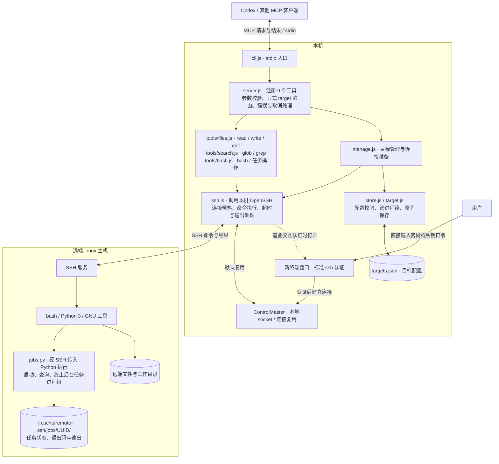

# remote-ssh MCP

基于 OpenSSH 的 MCP 服务，通过 stdio 向 AI 客户端提供远程文件读写、搜索、命令执行和后台任务管理。支持多个 SSH 目标，并通过终端交互完成认证。

每次调用显式指定 `target`；相对路径基于该目标的 `root`，绝对路径指向远端。`root` 是默认工作目录，不是访问沙箱；命令具有 SSH 账户的权限。

## 结构图



普通工具先查找目标并准备连接，再执行远端操作；目标增删改通过配置锁和原子保存生效。密码和私钥口令只交给新终端中的 OpenSSH，不经过 MCP 参数或目标配置。

图中展示默认连接复用模式；`controlPersist: 0` 时每次调用独立连接，仅支持免交互认证。远端无需安装 MCP 服务，后台任务和日志保存在远端，独立于本机 MCP 进程的生命周期。

## 安装与接入

本机需要 Node.js 20+、OpenSSH，以及可打开窗口的终端环境。推荐 Linux 桌面；也支持 macOS Terminal。Windows 请在 WSL 中运行并配置可用的终端启动命令。远端需要 Linux、bash、Python 3.9+ 和 GNU 常用工具（包括 `stat`、`base64`、`grep`）。

```sh
cd remote-ssh
npm ci
node src/cli.js --help
```

在支持 stdio 的 MCP 客户端中，设置启动命令为 `node`，参数为本项目 `src/cli.js` 的绝对路径。通用 JSON 示例：

```json
{
  "mcpServers": {
    "remote-ssh": {
      "command": "node",
      "args": ["/absolute/path/to/remote-ssh/src/cli.js"]
    }
  }
}
```

自定义配置文件可追加 `--targets /absolute/path/to/targets.json`。服务没有构建步骤，stdout 仅用于 MCP 协议，错误输出到 stderr。SDK 接入方式参考[官方 stdio 文档](https://github.com/modelcontextprotocol/typescript-sdk/blob/main/docs/get-started/first-server.md)。

## Linux SSH 兼容范围

**能用 `ssh` 登录，不等于能运行全部 MCP 工具。** 本服务使用 SSH 的非交互命令通道；远端必须允许执行命令，并提供 `sh`、`base64` 和目标目录访问权限。完整功能还需要安装说明中的 bash、Python 和 GNU 工具，后台任务依赖 Linux `/proc`。只有 SFTP、仅允许交互式 TTY、强制菜单或受限命令的账户，不能当作通用远程工作区使用；本服务不会绕过服务器权限限制。原生 Windows、macOS 远端不在当前支持范围内。

连接复用本机 OpenSSH 配置，包括 `Host` 别名、`HostName`、`User`、端口、`IdentityFile`、证书、`IdentityAgent`、`ProxyJump`、`ProxyCommand` 和认证方式。若平时通过 `ssh -i ... -J ... -p ...` 登录，将这些设置写入 `~/.ssh/config` 的独立别名，再把别名作为目标的 `ssh` 字段；该字段不接受整条 shell 命令，也不接受密码。

MCP 命令通道会关闭 `RemoteCommand`、TTY、标准输入丢弃和自动后台化，避免登录时自动运行 tmux 等命令或 `StdinNull` 破坏文件传输；也会清除本次连接的端口转发，避免与已有 SSH 会话争用端口，但保留 `ProxyJump` / `ProxyCommand` 路由。不会修改你的 SSH 配置文件或已有转发。若 `RemoteCommand` 原本用于进入容器或另一台机器，请为 MCP 配置直接到达目标环境的 SSH 别名。

远端脚本编码为单行后由 POSIX `sh` 解码执行，避免依赖默认登录 shell 的多行语法、引号或历史展开规则；文件内容仍走标准输入。非交互 shell 的启动脚本不要向 stdout 打印欢迎语等额外内容，以免污染结构化结果。

密码、私钥口令及 keyboard-interactive/二次认证由新终端中的 OpenSSH 处理，需要本机有可用桌面会话。自动探测的终端若启动后立即失败，会尝试下一个；显式指定 `REMOTE_SSH_TERMINAL` 时直接报告启动错误。禁用连接复用或没有桌面终端时，需要先配置可用的免交互密钥／Agent 认证。

SSH 配置项的原生语义参见 [OpenSSH 官方手册](https://man.openbsd.org/ssh_config)。主机指纹验证保持开启，不自动接受未知或变化的主机密钥，也不自动启用旧的加密算法。

## 认证：用户在新终端输入

1. 检查该目标是否已有可复用的 ControlMaster。
2. 尝试已配置的密钥或 ssh-agent。主机密钥必须已知，否则进入下一步。
3. 需要确认主机指纹、输入密码或解锁私钥时，新开终端运行标准 `ssh`。用户直接回答 OpenSSH 的提示；MCP 不接收、不保存这些输入。
4. 认证成功后 SSH 转入后台，终端中的命令结束，后续调用复用连接。连接默认保留 12 小时。

目标管理的 `add`、`update`、`connect` 和普通远程工具都使用此流程。并发调用共享一次预热，取消某个调用不会破坏其他调用正在等待的认证。主机密钥变化仍由 OpenSSH 拒绝；请在终端按实际情况处理。

终端在 **MCP 进程所在的本机** 打开，需要桌面会话及相应环境变量（例如 `DISPLAY` / `WAYLAND_DISPLAY` / `DBUS_SESSION_BUS_ADDRESS`）。支持常见 Linux 终端自动探测。可以明确指定：

```json
{
  "mcpServers": {
    "remote-ssh": {
      "command": "node",
      "args": ["/absolute/path/to/remote-ssh/src/cli.js"],
      "env": {
        "REMOTE_SSH_TERMINAL": "gnome-terminal --window -- bash -lc"
      }
    }
  }
}
```

`REMOTE_SSH_TERMINAL` 是终端可执行文件及参数；服务将完整 SSH 命令作为最后一个参数追加。不要填密码。默认等待输入 150 秒；客户端工具超时应至少设为 180 秒。前台长命令的客户端超时还需覆盖命令执行时间，或使用后台模式。

`controlPersist: 0` / `null` 禁用连接复用，只适合已完成主机指纹确认的免交互密钥/Agent 认证；密码或需输入口令的私钥请保留默认复用设置。

## 目标配置

默认文件为 `~/.config/remote-ssh/targets.json`，初始不存在时目标列表为空。可手写 JSON，也可由工具增删改。每次调用重新读取，配置损坏会报错并保留文件。工具写入使用跨进程锁和原子替换，文件权限为 `0600`。

```json
[
  {
    "name": "gpu",
    "ssh": "user@gpu.example.com",
    "port": 22,
    "root": "/home/user/project",
    "controlPersist": 43200
  }
]
```

`ssh` 也可以是 `~/.ssh/config` 中的别名；`IdentityFile`、`ProxyJump` 等由 OpenSSH 配置。支持 `user@host:2222`、`user@[::1]:2222`；裸 IPv6 的端口用 `port` 指定。`name` 唯一，不填时默认使用规范化后的 SSH 目标；`port` 和 `controlPersist` 可省略。配置严格接受上述五个字段。

## 工具

| 工具 | 作用 |
| --- | --- |
| `remote_ssh_targets` | `list` / `add` / `update` / `remove` / `connect` / `disconnect` / `status` |
| `read` | 分页读取远端 UTF-8 文本并显示行号 |
| `write` | 创建或完整覆盖文本文件，使用原子替换 |
| `edit` | 字面量替换；拒绝超过 4 MiB 的文件，写回前检查 mtime/size |
| `glob` | 文件路径匹配，最多 100 项 |
| `grep` | POSIX 扩展正则搜索，最多 250 条 |
| `bash` | 前台命令或后台任务；前台默认 120 秒，最长 600 秒 |
| `job_output` | 任务状态、输出分页，以及结束后的清理 |
| `job_kill` | 向任务进程组发送 TERM，必要时 3 秒后发送 KILL |

添加目标时验证连通性和目录；只有 `create: true` 才创建缺失的远端目录：

```json
{"action":"add","name":"gpu","ssh":"gpu-alias","root":"/data/project","create":true}
```

更新和连接使用 `target` 指定现有名称；更新时 `name` 可改名，`port: null` 清除端口覆盖。删除配置不会删除远程文件，也不会终止正在运行的任务。相同 SSH 目的地的多个目标共享连接，`disconnect` 会影响它们的连接复用。

```json
{"action":"connect","target":"gpu"}
```

读取文件：

```json
{"target":"gpu","file_path":"README.md","offset":1,"limit":100}
```

启动后台命令（`bash`）：

```json
{"target":"gpu","command":"python3 train.py","run_in_background":true}
```

返回 `job_id`，通过 `job_output` 查询：

```json
{"target":"gpu","job_id":"返回的 UUID","offset":0,"limit":65536}
```

结果包含 `status`、`exit_code`、`output`、`next_offset`、`has_more`。将 `next_offset` 传回继续读取；`running` 时暂时没有输出不代表结束。可用 `job_kill` 传入同一 `target` 与 `job_id` 终止任务。

任务和日志默认保存在远端 `~/.cache/remote-ssh/jobs/<job_id>/`，MCP 退出后仍运行，重启后凭相同目标和 ID 可查询。改名后用新目标名；改变 SSH 主机后旧任务仍在原主机。日志不会自动删除或限制磁盘占用：任务结束且读完输出后，用 `job_output` 的 `cleanup: true` 删除该任务记录。查询返回的 `completed` 表示进程结束，成功与否请检查 `exit_code`。

前台超时或取消会杀死本机 SSH 进程，远端命令可能继续运行；需要可靠终止时使用后台任务。任务主动创建新会话/守护进程的子进程可能脱离任务进程组。编辑通过 mtime/size 检查尽力检测冲突，不能替代远端文件锁。

## 环境变量

| 变量 | 默认值 / 用途 |
| --- | --- |
| `REMOTE_SSH_TARGETS_FILE` | `~/.config/remote-ssh/targets.json`，`--targets` 优先 |
| `REMOTE_SSH_CONTROL_DIR` | `~/.cache/remote-ssh/control`，目录权限 `0700` |
| `REMOTE_SSH_TERMINAL` | 自动探测；指定终端启动命令 |
| `REMOTE_SSH_CONNECT_TIMEOUT_MS` | `150000`，终端认证等待时间，范围 1000–150000 毫秒 |

SSH socket 路径过长时，可将 `REMOTE_SSH_CONTROL_DIR` 设置为属于自己的较短路径。远端可通过其环境变量 `REMOTE_SSH_JOB_DIR` 自定义任务记录位置。

## 验证

```sh
npm test
```

使用 Node 自带测试运行器。覆盖 MCP 新旧协议握手、工具参数、显式目标路由、配置增删改、终端认证复用、取消传递、文件读写、配置锁和后台任务生命周期。兼容性回归额外使用本机 `ssh -G` 检查登录配置隔离、身份与跳板路由保留，并验证单行脚本传输和终端启动失败处理。测试通过模拟 SSH 执行临时目录中的命令，不连接实际远端；真实桌面弹窗和真实服务器认证仍需在使用环境验证。

## 许可证

本项目采用 [MIT 许可证](LICENSE)。
