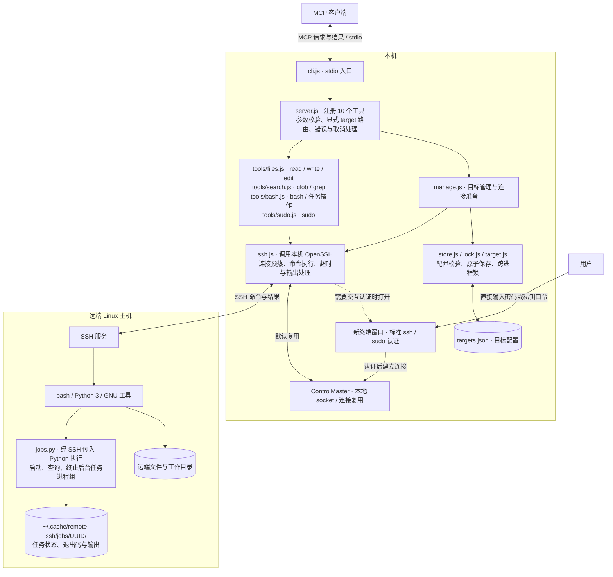

# remote-ssh MCP

remote-ssh MCP 是一个基于 OpenSSH 的 Model Context Protocol（MCP）服务，通过 stdio 向 MCP 客户端提供远端 Linux 主机上的文件读写、内容检索、命令执行与后台任务管理能力，使客户端能够将远端主机作为工作区使用。

服务不依赖远端 agent 或常驻进程：每次操作都由本机 `ssh` 调用完成，连接复用与认证由本机 OpenSSH 处理。密码与私钥口令仅在新开的终端窗口中输入，既不经过 MCP 参数，也不写入配置文件。

## 主要特性

- **多目标**：支持配置多个 SSH 目标；每次工具调用显式指定 `target`，不存在全局“当前主机”。
- **完整的工作区工具集**：提供 `read`、`write`、`edit`、`glob`、`grep`、`bash` 与后台任务工具。
- **连接复用**：默认复用 OpenSSH ControlMaster 连接，认证一次后可在连接保留期内复用。
- **远端免安装**：远端只需标准 Linux 环境，无需部署任何服务组件。
- **后台任务持久化**：任务在远端独立运行，MCP 进程重启后仍可查询与管理。
- **可提权执行**：`sudo` 工具以 root 运行单条命令；sudo 密码在本机新终端中输入，不经过 MCP 或模型。

## 架构



MCP 客户端通过 stdio 调用 `cli.js`。`server.js` 注册工具、校验参数并按 `target` 路由；`manage.js` 负责目标管理与连接准备；`store.js`、`lock.js` 与 `target.js` 负责配置校验、原子保存与跨进程互斥；`tools/` 生成远端命令；`ssh.js` 调用本机 OpenSSH。远端由 SSH 服务、bash、Python 3 与 GNU 工具执行命令，后台任务由 `jobs.py` 管理。

普通工具先解析目标并准备连接，再执行远端操作。密码和私钥口令只交给终端中的 OpenSSH，不经过 MCP。默认启用连接复用；`controlPersist: 0` 时每次调用建立独立连接，仅支持免交互认证。后台任务与日志保存在远端，独立于本机 MCP 进程的生命周期。

## 运行要求

### 本机

- Node.js 20 或更高版本
- OpenSSH 客户端
- 用于交互式认证的图形会话（无图形会话时需配置免交互认证）
- Linux 桌面或 macOS；Windows 需在 WSL 中运行，并配置可用的终端启动命令

### 远端

- Linux
- bash 与 POSIX `sh`
- Python 3.9 或更高版本
- GNU 常用工具，包括 `stat`、`base64` 与 `grep`
- 后台任务依赖 Linux `/proc`
- `sudo` 工具要求远端允许无 tty 执行 sudo（sudoers 未启用 `requiretty`）

### 兼容性说明

本服务使用 SSH 的非交互命令通道。远端账户必须允许执行命令，并能够访问 `sh`、`base64` 与目标目录。仅支持 SFTP、仅允许交互式 TTY，或强制菜单/受限命令的账户不能用作通用远程工作区；服务不会绕过服务端的权限限制。原生 Windows 与 macOS 远端不在支持范围内。

## 安装

```sh
cd remote-ssh
npm ci
node src/cli.js --help
```

服务没有构建步骤。运行期间，stdout 仅用于 MCP 协议，日志与错误输出到 stderr。

在支持 stdio 的 MCP 客户端中，将启动命令设为 `node`，参数设为 `src/cli.js` 的绝对路径：

```json
{
  "mcpServers": {
    "remote-ssh": {
      "command": "node",
      "args": ["/absolute/path/to/remote-ssh/src/cli.js"]
    }
  }
}
```

使用自定义配置文件时，追加 `--targets /absolute/path/to/targets.json`。SDK 接入方式参见[官方 stdio 文档](https://github.com/modelcontextprotocol/typescript-sdk/blob/main/docs/get-started/first-server.md)。

## 核心概念

### 目标与 root

目标（target）是一条命名的 SSH 连接配置。每次工具调用通过 `target` 字段显式选择目标；相对路径基于该目标的 `root` 解析，绝对路径直接指向远端。`root` 是默认工作目录，不是访问沙箱；命令以 SSH 账户的权限执行。

### 目标配置

默认配置文件为 `~/.config/remote-ssh/targets.json`，文件不存在时目标列表为空。配置可手工编辑，也可通过 `remote_ssh_targets` 工具维护。服务在每次调用时重新读取配置；文件损坏时会报错，并保持原文件不变。写入采用临时文件加原子替换，并受跨进程锁保护，文件权限为 `0600`。配置严格接受以下五个字段：

```json
[
  {
    "name": "gpu",
    "ssh": "user@gpu.example.com",
    "port": 22,
    "root": "/home/user/project",
    "controlPersist": 43200
  }
]
```

- `name`（可选）：目标名称，必须唯一；省略时使用规范化后的 SSH 目标。
- `ssh`（必填）：`~/.ssh/config` 中的别名或 `user@host`。支持 `user@host:2222` 与 `user@[::1]:2222`；裸 IPv6 地址的端口用 `port` 指定。该字段不接受整条 shell 命令，也不接受密码。
- `port`（可选）：SSH 端口覆盖；更新时传入 `null` 可清除覆盖。
- `root`（必填）：远端绝对路径，不接受 NUL 或 `..` 路径段。
- `controlPersist`（可选）：连接复用保留时间，单位为秒，默认 43200（12 小时），上限 31536000；`0` 或 `null` 禁用连接复用。

### 连接复用

服务使用 OpenSSH 的 ControlMaster 与 ControlPersist 复用连接。同一 SSH 目的地（包括指向同一连接的不同别名）共享一条连接与一次认证结果，连接默认保留 12 小时。

连接复用沿用本机 OpenSSH 配置，包括 `Host` 别名、`HostName`、`User`、端口、`IdentityFile`、证书、`IdentityAgent`、`ProxyJump`、`ProxyCommand` 与认证方式。若日常使用 `ssh -i ... -J ... -p ...` 登录，应将这些参数写入 `~/.ssh/config` 的独立别名，再将该别名作为目标的 `ssh` 字段。

MCP 命令通道会关闭 `RemoteCommand`、TTY、`StdinNull` 与自动后台化，并清除本次连接的端口转发，同时保留 `ProxyJump`、`ProxyCommand` 路由与身份配置。服务不会修改用户的 SSH 配置文件或既有转发。若原先通过 `RemoteCommand` 进入容器或另一台主机，应为目标配置直接到达该环境的 SSH 别名。

远端命令编码为单行后由 POSIX `sh` 解码执行，不依赖登录 shell 的多行语法、引号或历史展开规则；文件内容通过标准输入传输。非交互 shell 的启动脚本不应向 stdout 输出内容，以免干扰结构化结果。

### 认证

连接准备按以下顺序进行：

1. 检查目标是否已有可复用的 ControlMaster 连接。
2. 尝试已配置的密钥或 ssh-agent。主机密钥必须已知。
3. 当需要确认主机指纹、输入密码或解锁私钥时，在 MCP 进程所在本机的新终端中运行标准 `ssh`。用户直接与 OpenSSH 交互，服务不接收也不保存这些输入。
4. 认证成功后，SSH 连接转入后台，终端中的命令结束；后续调用复用该连接。

目标的 `add`、`update`、`connect` 以及所有远程工具均使用此流程。并发调用共享同一次连接准备，取消单次调用不会破坏其他调用正在等待的认证。主机密钥验证保持开启，服务不会自动接受未知或变化的主机密钥，也不会自动启用旧算法。

终端在新窗口打开，需要图形会话及相应环境变量（例如 `DISPLAY`、`WAYLAND_DISPLAY`、`DBUS_SESSION_BUS_ADDRESS`）。服务会自动探测常见 Linux 终端，也可通过 `REMOTE_SSH_TERMINAL` 显式指定：

```json
{
  "mcpServers": {
    "remote-ssh": {
      "command": "node",
      "args": ["/absolute/path/to/remote-ssh/src/cli.js"],
      "env": {
        "REMOTE_SSH_TERMINAL": "gnome-terminal --window -- bash -lc"
      }
    }
  }
}
```

`REMOTE_SSH_TERMINAL` 指定终端可执行文件及其参数，服务会把完整的 SSH 命令作为最后一个参数追加；其中不应包含密码。默认等待输入 150 秒，客户端的单次工具超时应不低于 180 秒。前台长命令的客户端超时还需覆盖命令执行时间，或改用后台模式。禁用连接复用或缺少图形终端时，需预先配置可用的免交互密钥或 ssh-agent 认证。

## 工具

| 工具 | 作用 |
| --- | --- |
| `remote_ssh_targets` | 目标的 `list` / `add` / `update` / `remove` / `connect` / `disconnect` / `status` |
| `read` | 分页读取远端 UTF-8 文本并显示行号 |
| `write` | 创建或完整覆盖文本文件，采用原子替换 |
| `edit` | 字面量替换；文件大小上限 4 MiB，写回前校验 mtime/size |
| `glob` | 按 glob 模式匹配文件路径，最多返回 100 项 |
| `grep` | POSIX 扩展正则搜索，最多返回 250 条 |
| `bash` | 前台命令或后台任务；前台默认 120 秒，上限 600 秒 |
| `sudo` | 以 root 执行单条前台命令；密码由用户在新终端输入 |
| `job_output` | 任务状态与输出分页，以及结束后的清理 |
| `job_kill` | 向任务进程组发送 SIGTERM，必要时 3 秒后发送 SIGKILL |

### 目标管理

`remote_ssh_targets` 通过 `action` 字段执行操作。`add` 与 `update` 会验证远端连通性与 `root` 目录，并在需要时触发交互式认证；仅当 `create: true` 时创建缺失的 `root` 目录：

```json
{"action":"add","name":"gpu","ssh":"gpu-alias","root":"/data/project","create":true}
```

`update` 与 `connect` 通过 `target` 指定现有名称。更新时可通过 `name` 改名，通过 `port: null` 清除端口覆盖。删除配置不会删除远端文件，也不会终止正在运行的任务。指向同一 SSH 目的地的多个目标共享连接，因此 `disconnect` 会影响它们的连接复用：

```json
{"action":"connect","target":"gpu"}
```

### 文件

`read` 分页读取 UTF-8 文本，返回带行号的内容，默认从第 1 行开始，最多 2000 行：

```json
{"target":"gpu","file_path":"README.md","offset":1,"limit":100}
```

`write` 创建或完整覆盖文件，写入通过临时文件加原子替换完成，父目录会自动创建。`edit` 以字面量替换文本，`replace_all` 为 `false` 时 `old_string` 必须唯一。文本工具要求内容为合法 UTF-8；`read` 会拒绝二进制或无法解码的内容，`edit` 会拒绝超过 4 MiB 的文件。

### 搜索

`glob` 按 glob 模式匹配文件路径，不返回目录，结果按修改时间倒序，最多 100 项。模式不含 `/` 时匹配任意深度的文件名；`.git`、`.svn`、`.hg` 与 `node_modules` 目录会被跳过。

`grep` 使用 POSIX 扩展正则搜索文件内容，按文件分组返回带行号的结果，最多 250 条。`include` 可用于限定文件名模式；`.git` 与 `node_modules` 目录以及二进制文件会被跳过。

### 命令执行

`bash` 在远端执行命令，每次调用启动新的 shell，命令以 SSH 账户的权限运行。前台命令默认超时 120 秒，上限 600 秒；`run_in_background: true` 时改为启动持久后台任务。

### 提权执行（sudo）

`sudo` 在远端以 root 权限执行单条前台命令。由于 sudo 需要密码，该工具会在运行 MCP 服务的本机新开一个终端窗口提示用户输入；用户输入的密码由终端直接通过已认证的 SSH stdin 管道传给远端的 `sudo -S`，不经过 MCP 进程、工具参数、模型或任何文件，也不会被回显或以 argv 形式出现。只有命令的标准输出、标准错误与退出码会返回。

```json
{"target":"gpu","command":"apt-get update","workdir":"/"}
```

远端命令通过 `sudo -S`（从 stdin 读取密码）执行，不分配远端 tty，以避免密码被回显。因此远端需要允许无 tty 的 sudo，即 sudoers 未启用 `requiretty`。工具仅支持前台执行，默认整体超时 300 秒、上限 600 秒，超时预算包含用户输入密码的时间；超时或取消时只终止本机 SSH 进程，远端命令可能继续运行。SSH 连接必须已经建立（工具调用前会自动完成连接准备），终端中的 ssh 使用 BatchMode，不会提示 SSH 凭据。

## 后台任务

通过 `bash` 的 `run_in_background: true` 启动后台命令：

```json
{"target":"gpu","command":"python3 train.py","run_in_background":true}
```

调用返回 `job_id`，通过 `job_output` 查询状态与输出：

```json
{"target":"gpu","job_id":"<job_id>","offset":0,"limit":65536}
```

结果包含 `status`、`exit_code`、`output`、`next_offset` 与 `has_more`。将 `next_offset` 作为下一次调用的 `offset` 可无重复地继续读取。状态为 `running` 时暂时没有输出，并不表示任务已经结束。

`job_kill` 使用相同的 `target` 与 `job_id`，向任务进程组发送 SIGTERM；若 3 秒后仍未结束，则发送 SIGKILL。输出仍可通过 `job_output` 读取。

任务状态与输出默认保存在远端 `~/.cache/remote-ssh/jobs/<job_id>/`。任务在 MCP 进程退出后继续运行，重启后凭相同目标与 ID 可继续查询。目标改名后需使用新名称；更改 SSH 主机后，旧任务仍保留在原主机。日志不会自动删除，也不限制磁盘占用；任务结束且输出读取完毕后，可用 `job_output` 的 `cleanup: true` 删除该任务记录。`status` 为 `completed` 仅表示进程已结束，成功与否需检查 `exit_code`。

前台命令超时或被取消时，只会终止本机 SSH 进程，远端命令可能继续运行；需要可靠终止时应使用后台任务。任务主动创建新会话或守护进程的子进程可能脱离任务进程组。

## 并发与一致性

服务支持一个或多个 MCP 进程并发访问同一台或不同主机。每个 MCP 客户端应启动独立的 stdio 服务进程，不应共用同一条 stdin/stdout。每次调用独立指定 `target` 与工作目录，不存在全局状态。

- 在同一操作系统用户下，共用 `REMOTE_SSH_CONTROL_DIR` 的进程会按 OpenSSH 解析后的 ControlPath 协调连接准备；指向同一连接的不同别名共享认证，不会重复弹出认证窗口。不同服务器独立认证，连接就绪后命令并行执行。取消单次调用不会取消其他调用，也不会中断共享的连接准备。
- 共用配置文件时，网络检查与用户输入不占用配置锁；保存时会短暂加锁并原子替换。若目标在验证期间被其他进程修改，更新会报告冲突而不覆盖新配置，此时应重新读取后重试。
- 后台任务使用独立 UUID。修改或删除目标配置不会影响已经开始的任务。

并发访问不提供任意并发写入的保护：多个 `write` 同时覆盖同一文件时，最后一次写入生效；`edit` 的 mtime/size 校验只能尽力检测冲突，不能替代文件锁或内容合并。多个调用方编辑同一项目时，应划分文件或使用独立工作目录。`disconnect` 会关闭共享连接，可能中断其他调用方正在执行的操作；目标改名或删除、任务终止与日志清理同属共享管理操作，需要调用方自行协调。

并发规模仍受 SSH 服务端限制。例如每条复用连接的 `MaxSessions` 默认为 10，此外还有连接数与资源限制（见 [sshd_config](https://man.openbsd.org/sshd_config#MaxSessions)）。高并发任务应由调用方限制同时运行的前台命令数量，或改为启动后台任务后轮询。服务不会自动重试可能产生副作用的命令。

## 环境变量

| 变量 | 默认值 / 用途 |
| --- | --- |
| `REMOTE_SSH_TARGETS_FILE` | `~/.config/remote-ssh/targets.json`；`--targets` 优先 |
| `REMOTE_SSH_CONTROL_DIR` | `~/.cache/remote-ssh/control`；目录权限 `0700` |
| `REMOTE_SSH_TERMINAL` | 终端启动命令；默认自动探测 |
| `REMOTE_SSH_CONNECT_TIMEOUT_MS` | `150000`；终端认证等待时间，范围 1000–150000 毫秒 |
| `REMOTE_SSH_LOCK_TIMEOUT_MS` | `150000`；等待配置锁的最长时间 |
| `REMOTE_SSH_LOCK_GRACE_MS` | `5000`；空锁被判定为过期前的宽限时间 |
| `REMOTE_SSH_LOCK_RETRY_MS` | `50`；配置锁重试间隔 |

SSH socket 路径过长时，可将 `REMOTE_SSH_CONTROL_DIR` 设置为较短的用户路径。远端可通过环境变量 `REMOTE_SSH_JOB_DIR` 自定义任务记录位置。

## 测试

```sh
npm test
```

测试使用 Node.js 内置测试运行器，覆盖 MCP 新旧协议握手、工具参数校验、目标路由、配置增删改、终端认证复用、取消传递、文件读写、配置锁与后台任务生命周期。`sudo` 用例验证密码经终端读入并管道到 sudo 的 stdin、错误密码与缺失终端的处理，以及超时。并发用例使用多个独立进程验证同主机/别名认证合并、不同主机互不阻塞、配置冲突，以及两个 stdio 客户端的并发调用与取消隔离。兼容性用例使用本机 `ssh -G` 验证登录配置隔离、身份与跳板路由保留，并检查单行脚本传输与终端启动失败处理。测试通过模拟 `ssh` 在临时目录中执行命令，不连接真实远端；真实终端弹窗与服务器认证仍需在使用环境中验证。

## 形式化验证

并发与安全关键协议使用 TLA+ 建模，并通过 TLC 穷举所有可达状态进行检查。覆盖目标配置锁、连接预热去重、后台任务生命周期与 sudo 密码信息流；需要 Java 11+ 与 `tla2tools.jar`：

```sh
TLA2TOOLS_JAR=/path/to/tla2tools.jar npm run verify
```

- `formal/Lock.tla`：修复后的锁协议满足互斥、闸门互斥与“规范路径不出现空壳”；
- `formal/Warmup.tla`：同一目的地在途预热至多一个，且不会并发打开认证终端或在失败缓存期内重弹终端；
- `formal/Jobs.tla`：进程存活或输出未读尽时绝不删除任务目录，状态与记录事实一致；
- `formal/Sudo.tla`：sudo 密码不出现在 MCP 状态、工具结果、磁盘、日志或 argv 中。

同时保留四个“反设计”对照，TLC 必须仍然反证它们，以证明模型对该性质确实敏感：`LockHuskRace.tla`（`MutualExclusion`）、`WarmupNoDedup`（`NoConcurrentTerminals`）、`JobsUnsafe`（`NoUnreadOutputLost`）、`SudoViaMcp`（`Secrecy`）。其中 `LockHuskRace` 记录了一次真实修复：创建者在 `mkdir` 与写 owner 之间停顿超过宽限期时，其按路径写入可能落入后继进程的锁目录，导致两者同时进入临界区。详见 [`formal/README.md`](formal/README.md)。

## 许可证

本项目采用 [MIT 许可证](LICENSE)。
